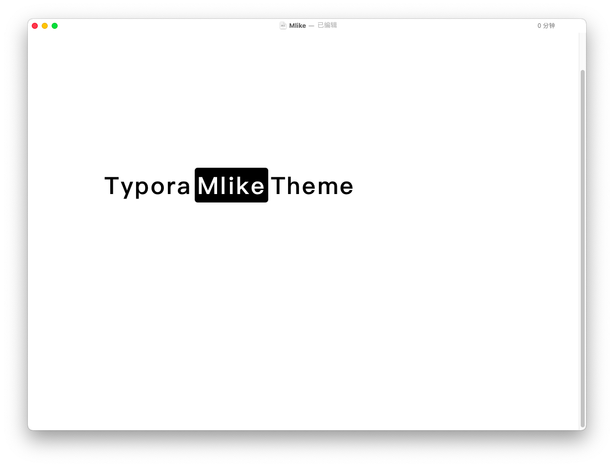
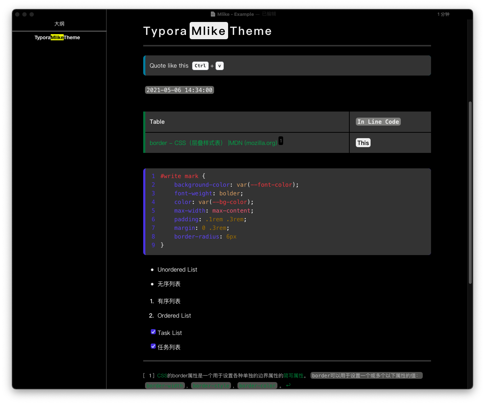
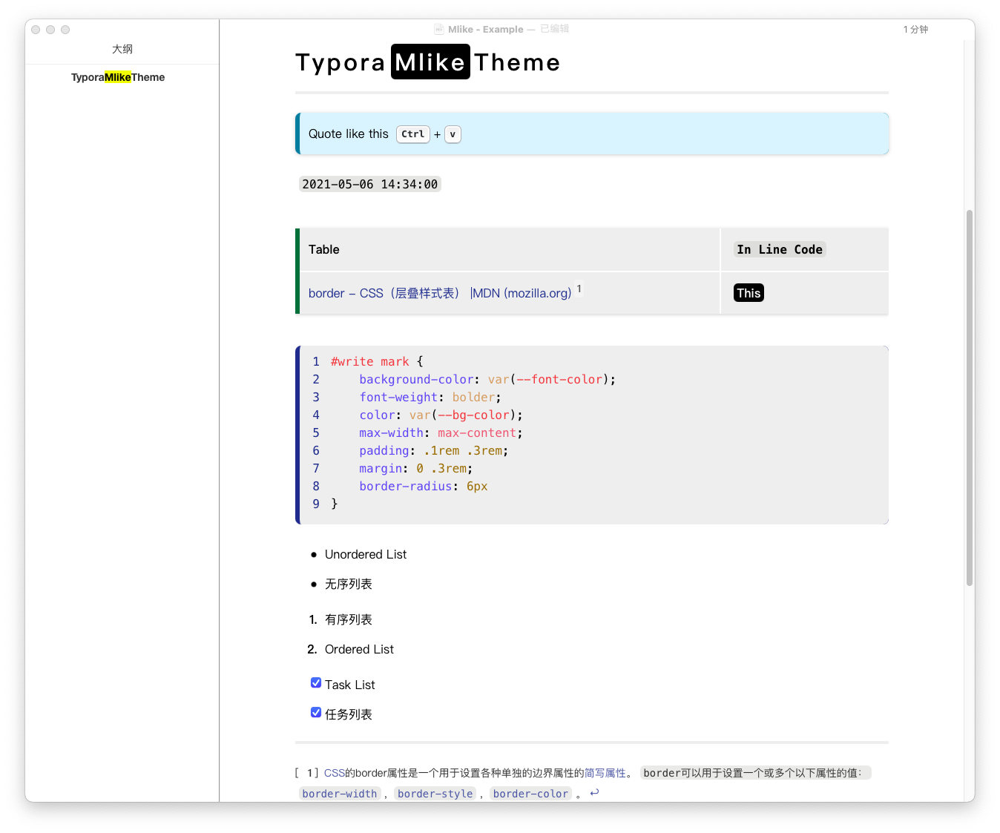

### Typora-mlike-theme

---

>   这个是 Typora 编辑器的自定义主题

#### 关于 Typora

[Typora — a markdown editor, markdown reader.](https://typora.io/)是一款强大的 Markdown 格式的文本编辑器，Typora 为您提供了作为读者和作家的无缝体验。它删除所有其他不必要的干扰，提供了一个真正的实时预览功能，帮助您专注于内容本身。

#### 关于 Mlike

Mlike 是我为了学习 Typora Theme 而创建的一款 Typora 自定义主题，之所以叫 `mlike` 是因为借鉴了[MDN Web Docs (mozilla.org)](https://developer.mozilla.org/zh-CN/)的样式(但最后发现并不像 emm...)

#### 主题的安装方法

1.  下载本主题的`mlike.css`文件
2.  打开`Typora`, 点击菜单栏的`偏好设置`-`外观`-`打开主题文件夹`
3.  将`mlike.css`文件复制到文件夹下
4.  重新启动`Typora`，点击菜单栏的`主题`-`mlike`

具体的安装方法可查看 [Install Theme (typora.io)](https://theme.typora.io/doc/Install-Theme/)

#### 预览图








#### LICENSE

```
MIT License

Copyright (c) 2021 Vanke Anton
```

