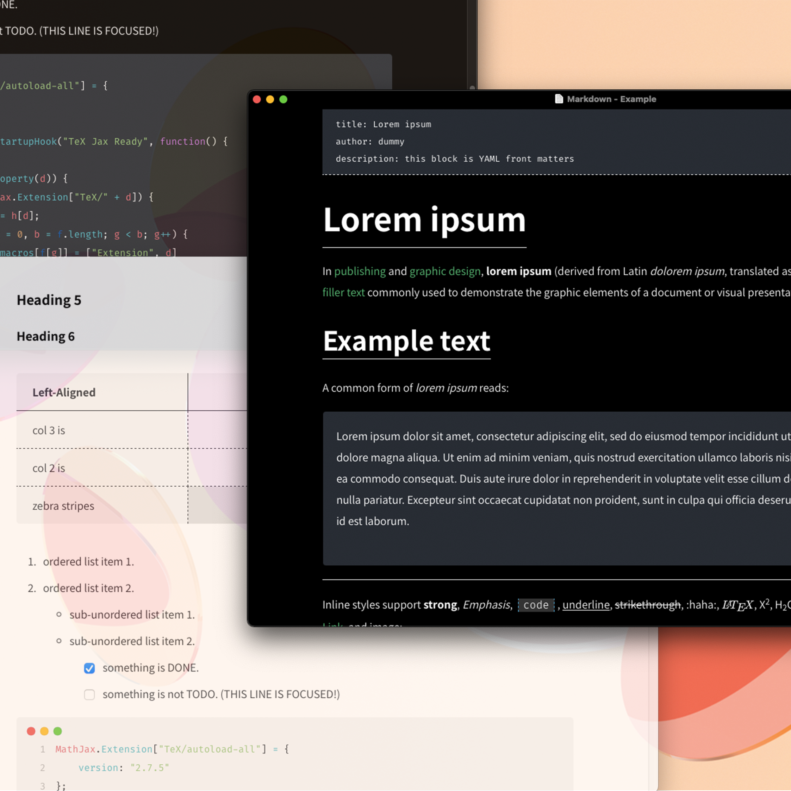

<a href="https://github.com/AntonVanke/typora-mlike-theme/releases"></a>
<a href="https://github.com/AntonVanke/typora-mlike-theme/releases"></a>

---

[简体中文](README.md) | `English`

>   This is the custom theme of the typora editor, if you don't know `Typora` yet，Please visit[Typora — a markdown editor, markdown reader.](https://typora.io/)

#### About Mlike



`Mlike`,Define it the way I like ` markdown`。I'm not very familiar with `CSS`，But I wrote this theme by searching on [ MDN (mozilla.org)](https://developer.mozilla.org/zh-CN/docs/Learn/CSS)。If you happen to like this theme, you can click `star`，If you have any ideas or suggestions, please let me know`Issue/PR`. Thank you.

###### I use MAC development, if you have problems on other systems, please submit `issue`.

#### How to install theme

1.  Put the `mlike`folder, `mlike.css` `mlike-light.css`and `mlike-dark.css` into the theme folder.
2.  Reopen Typora.
3.  Switch theme to`mlike-light.css` or `mlike-dark.css` .

Please refer to [Install Theme (typora.io)](https://theme.typora.io/doc/Install-Theme/)

#### Preview


>   For more previews, see [`preview.md`](_preview/preview.md) file.

CodeMirror Theme is `ONE`

#### LICENSE

```License
MIT License

Copyright (c) 2021 Vanke Anton
```

